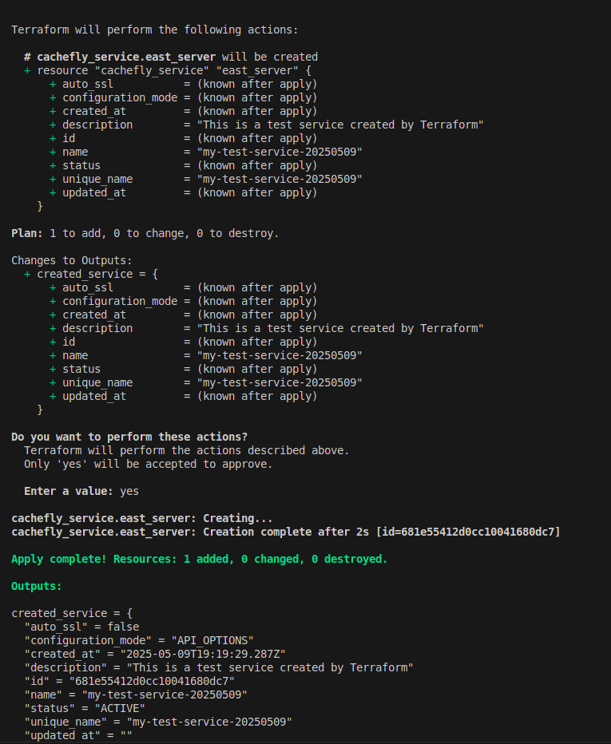

# Terraform Provider for CacheFly

This is a Terraform provider for [CacheFly](https://www.cachefly.com/), built using the Terraform Plugin Framework and the official CacheFly Go SDK.

> ⚠️ This provider is in active development and is not yet published to the Terraform Registry.

## Usage

```hcl
terraform {
  required_providers {
    cachefly = {
      source  = "cachefly.com/avvvet/cachefly"
      version = "0.1.0"
    }
  }
}

provider "cachefly" {
  api_token = "your-cachefly-api-token" # Replace with a valid CacheFly API token
}

#data "cachefly_services" "example" {}

data "cachefly_services" "list_services" {
  response_type    = "shallow"
  include_features = false
  status           = "ACTIVE"
  offset           = 0
  limit            = 10
}

output "services" {
  value = data.cachefly_services.list_services.services
}
```

## Outputs

The following shows the Terraform output for the `cacheflys_services` data source, displaying the list of services retrieved from CacheFly.

